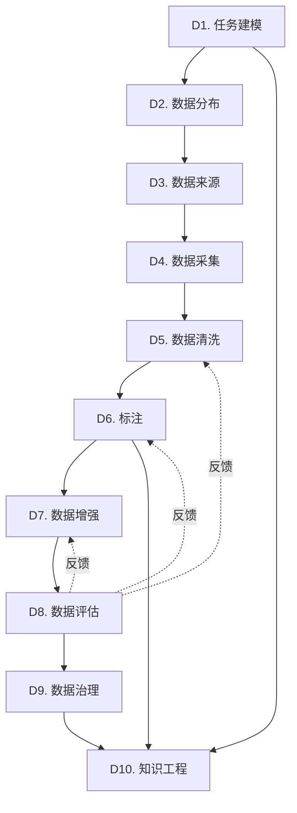

# 整体架构：体系全景图

## 架构总览

数据构建科学体系由五大部分组成，形成一个完整的知识-工程-治理-应用闭环：

```
┌─────────────────────────────────────────────────────────────┐
│                  数据构建科学体系 1.0                        │
│                Data Construction Science                     │
└─────────────────────────────────────────────────────────────┘
                            │
        ┌───────────────────┼───────────────────┐
        │                   │                   │
        ▼                   ▼                   ▼
┌──────────────┐   ┌──────────────┐   ┌──────────────┐
│ 理论基础层   │   │ 工程实现层   │   │ 治理保障层   │
│ (学科体系)   │   │ (工程体系)   │   │ (治理体系)   │
└──────────────┘   └──────────────┘   └──────────────┘
        │                   │                   │
        └───────────────────┼───────────────────┘
                            ▼
                    ┌──────────────┐
                    │ 闭环机制层   │
                    │ (Learning)   │
                    └──────────────┘
                            │
                            ▼
                    ┌──────────────┐
                    │ 应用实践层   │
                    │ (Applications)│
                    └──────────────┘
```

## 第一层：理论基础层（10大核心学科）

这是整个体系的知识骨架，回答"数据构建需要哪些理论支撑"。

### 学科地图

```
数据构建科学学科体系
│
├── 前端（需求侧）
│   ├── D1. 任务建模科学 → 把业务需求转化为数据需求
│   └── D2. 数据分布科学 → 设计数据应该具备的分布形态
│
├── 中端（生产侧）
│   ├── D3. 数据来源科学 → 确定数据从哪里来
│   ├── D4. 数据采集科学 → 系统地采集数据
│   ├── D5. 数据清洗科学 → 提升数据质量
│   ├── D6. 标注科学 → 为数据打上高质量标签
│   └── D7. 数据增强科学 → 扩展数据多样性和规模
│
├── 后端（保障侧）
│   ├── D8. 数据评估科学 → 量化评估数据质量
│   └── D9. 数据治理科学 → 管理数据全生命周期
│
└── 顶层（知识侧）
    └── D10. 数据知识工程 → 将数据结构化为知识资产
```

### 学科间的依赖关系



### 学科分类矩阵

| 学科 | 理论强度 | 工程强度 | 通用性 | 专业门槛 |
|------|---------|---------|--------|---------|
| D1. 任务建模 | ★★★★★ | ★★★☆☆ | ★★★★★ | ★★★★☆ |
| D2. 数据分布 | ★★★★★ | ★★★☆☆ | ★★★★★ | ★★★★☆ |
| D3. 数据来源 | ★★★☆☆ | ★★★★☆ | ★★★★☆ | ★★★☆☆ |
| D4. 数据采集 | ★★☆☆☆ | ★★★★★ | ★★★☆☆ | ★★☆☆☆ |
| D5. 数据清洗 | ★★★★☆ | ★★★★★ | ★★★★★ | ★★★☆☆ |
| D6. 标注 | ★★★★☆ | ★★★★☆ | ★★★★☆ | ★★★★★ |
| D7. 数据增强 | ★★★★☆ | ★★★★☆ | ★★★★☆ | ★★★☆☆ |
| D8. 数据评估 | ★★★★★ | ★★★★☆ | ★★★★★ | ★★★★☆ |
| D9. 数据治理 | ★★★☆☆ | ★★★★★ | ★★★★★ | ★★★☆☆ |
| D10. 知识工程 | ★★★★★ | ★★★★☆ | ★★★☆☆ | ★★★★★ |

## 第二层：工程实现层（4大工程体系）

将理论转化为可执行的系统，回答"如何落地实施"。

### 工程体系架构

```
┌─────────────────────────────────────────────────┐
│            E2. 数据平台工程                      │
│  (Data Platform: 数据湖、版本控制、元数据)        │
└─────────────────────────────────────────────────┘
                      ▲
                      │ 数据存储与管理
                      │
┌─────────────────────┴──────────────────────────┐
│            E1. 数据流水线工程                   │
│  (Pipeline: 采集→清洗→标注→增强→评估)          │
└────────────┬───────────────────┬────────────────┘
             │                   │
    ┌────────▼────────┐  ┌──────▼──────────┐
    │ E3. 自动化生成  │  │ E4. 模型反馈    │
    │ (LLM/生成模型)  │  │ (主动学习/挖掘) │
    └─────────────────┘  └─────────────────┘
```

### 工程体系的分工

| 工程体系 | 核心职责 | 输入 | 输出 | 关键技术 |
|---------|---------|------|------|---------|
| **E1. 流水线** | 数据生产全流程 | 原始数据 | 标注数据 | 调度、监控、质控 |
| **E2. 平台** | 存储与管理 | 数据+元数据 | 数据服务 | 数据湖、版本控制 |
| **E3. 自动生成** | 规模化生成 | Prompt+种子数据 | 合成数据 | LLM、生成模型 |
| **E4. 模型反馈** | 数据优化 | 模型预测 | 改进建议 | 主动学习、挖掘 |

### 工程成熟度模型

| 级别 | 特征 | 典型场景 |
|------|------|---------|
| **L1: 手工作坊** | 脚本+人工 | 小规模实验 |
| **L2: 半自动化** | 简单流水线 | 单任务项目 |
| **L3: 流水线化** | 完整Pipeline | 多任务复用 |
| **L4: 平台化** | 统一平台 | 企业级应用 |
| **L5: 智能化** | 自动闭环 | AI原生系统 |

## 第三层：治理保障层（治理体系）

确保数据构建的合规、安全、可信，回答"如何保障质量和合规"。

### 治理架构

```
┌─────────────────────────────────────────────┐
│              治理体系                        │
└─────────────────────────────────────────────┘
         │
         ├── 伦理层：隐私、公平、透明
         │     ├── 数据隐私保护
         │     ├── 算法公平性
         │     └── 可解释性
         │
         ├── 合规层：法律法规遵从
         │     ├── GDPR / HIPAA / 金融监管
         │     ├── 数据使用授权
         │     └── 跨境数据传输
         │
         ├── 质量层：标准与认证
         │     ├── 数据质量等级（DQ Level 1-5）
         │     ├── 标注质量标准
         │     └── 质量审计流程
         │
         └── 运营层：生命周期管理
               ├── 版本管理（v1, v2, v3...）
               ├── 权限控制（RBAC）
               ├── 审计追踪（Audit Log）
               └── 数据归档与销毁
```

### 数据质量等级体系

| 等级 | 标准 | 适用场景 |
|------|------|---------|
| **DQ-1** | 基础可用（噪声<20%） | 研究实验 |
| **DQ-2** | 良好质量（噪声<10%） | 一般应用 |
| **DQ-3** | 高质量（噪声<5%） | 生产系统 |
| **DQ-4** | 卓越质量（噪声<2%） | 关键应用 |
| **DQ-5** | 完美质量（噪声<0.5%） | 高风险应用 |

## 第四层：闭环机制层（数据-模型闭环）

实现数据与模型的协同进化，回答"如何持续优化"。

### 闭环架构

```
     ┌─────────┐
     │ 数据 v1  │
     └────┬────┘
          │
          ▼
     ┌─────────┐
     │ 模型 v1  │
     └────┬────┘
          │
          ▼
    ┌──────────┐
    │ 评估分析  │ ──┐
    └──────────┘   │
          │         │
          ▼         │ 发现问题
    ┌──────────┐   │
    │ 错误挖掘  │ ◄─┘
    └────┬─────┘
          │
          ▼
    ┌──────────┐
    │ 数据改进  │
    └────┬─────┘
          │
          ▼
    ┌──────────┐
    │ 数据 v2   │
    └────┬─────┘
          │
          ▼
         ...
```

### 闭环的四个阶段

1. **冷启动阶段**
   - 专家知识 + 规则生成少量种子数据
   - 训练基线模型

2. **快速迭代阶段**
   - 模型挖掘困难样本
   - 主动学习驱动标注
   - 每周一个数据版本

3. **精细打磨阶段**
   - 长尾补充
   - 对抗样本
   - 边缘case

4. **持续运营阶段**
   - 监控线上数据分布漂移
   - 自动触发数据更新

## 第五层：应用实践层

将体系应用到具体任务，回答"如何解决实际问题"。

### 应用地图

```
┌───────────────────────────────────────────────────┐
│                   应用层                           │
└───────────────────────────────────────────────────┘
        │
        ├── NLP领域
        │   ├── 文本分类（使用 D1,D2,D5,D6,D7,D8）
        │   ├── 命名实体识别
        │   ├── 问答系统（使用 D1,D6,D10,D9）
        │   └── 对话系统（使用 D1,D3,D7,D10）
        │
        ├── CV领域
        │   ├── OCR（使用 D2,D4,D5,D7）
        │   ├── 医疗图像（使用 D2,D5,D6,D9）
        │   ├── 目标检测
        │   └── 人脸识别
        │
        ├── 语音领域
        │   ├── 语音识别（使用 D2,D4,D7,D8）
        │   └── 语音合成
        │
        └── 决策领域
            ├── 推荐系统（使用 D3,D4,D10）
            ├── 金融风控（使用 D1,D2,D9）
            └── 智能诊断
```

### 任务-学科映射矩阵

| 任务 | D1 | D2 | D3 | D4 | D5 | D6 | D7 | D8 | D9 | D10 | E1 | E2 | E3 | E4 |
|------|----|----|----|----|----|----|----|----|----|----|----|----|----|----|
| NLP分类 | ✓ | ✓ |  |  | ✓ | ✓ | ✓ | ✓ |  |  | ✓ | ✓ |  | ✓ |
| 多轮对话 | ✓ |  | ✓ |  |  | ✓ | ✓ |  |  | ✓ | ✓ | ✓ | ✓ | ✓ |
| OCR |  | ✓ |  | ✓ | ✓ |  | ✓ |  |  |  | ✓ | ✓ | ✓ |  |
| 语音识别 |  | ✓ |  | ✓ |  |  | ✓ | ✓ |  |  | ✓ | ✓ |  | ✓ |
| 医疗图像 |  | ✓ |  |  | ✓ | ✓ |  |  | ✓ |  | ✓ | ✓ |  |  |
| 推荐系统 |  |  | ✓ | ✓ |  |  |  |  |  | ✓ | ✓ | ✓ |  | ✓ |
| 金融风控 | ✓ | ✓ |  |  |  |  |  |  | ✓ |  | ✓ | ✓ |  | ✓ |
| 法律问答 | ✓ |  |  |  |  | ✓ |  |  | ✓ | ✓ | ✓ | ✓ | ✓ |  |

## 横向能力：跨层支撑

### 1. 度量体系（贯穿所有层）

```
度量体系
├── 数据度量
│   ├── 质量指标（准确率、一致性、覆盖率）
│   └── 分布指标（多样性、平衡性）
├── 过程度量
│   ├── 效率指标（标注速度、处理吞吐）
│   └── 成本指标（人力成本、计算成本）
└── 效果度量
    ├── 模型指标（准确率、召回率、F1）
    └── 业务指标（用户满意度、ROI）
```

### 2. 工具链（支撑工程实现）

```
工具链
├── 标注工具（Label Studio, Doccano, CVAT）
├── 数据管理（DVC, Pachyderm, LakeFS）
├── 质量检测（Great Expectations, Evidently）
├── 增强工具（Albumentations, NLPAug）
└── 平台框架（Airflow, Kubeflow, MLflow）
```

### 3. 标准规范（指导实施）

```
标准规范
├── 数据格式标准（JSON Schema, Protobuf）
├── 标注协议标准（Annotation Protocol Template）
├── 质量评估标准（Quality Metrics Definition）
└── 交付标准（Deliverable Checklist）
```

## 体系的使用路径

### 路径1：从零开始（新任务）
```
1. 任务建模（D1） → 定义任务和指标
2. 数据分布设计（D2） → 规划数据需求
3. 数据来源规划（D3） → 确定数据来源
4. 搭建流水线（E1） → 建立生产能力
5. 执行数据生产（D4-D7） → 生成初版数据
6. 数据评估（D8） → 质量检查
7. 模型训练 → 获得基线
8. 启动闭环（E4） → 持续优化
```

### 路径2：优化现有系统
```
1. 现状评估 → 找出瓶颈
2. 定位学科 → 确定需要改进的学科
3. 应用方法 → 实施具体优化
4. 效果验证 → 度量改进效果
5. 持续迭代 → 闭环优化
```

### 路径3：构建平台能力
```
1. 选择工程体系（E1-E4） → 规划平台架构
2. 引入治理体系 → 建立规范
3. 集成工具链 → 开发平台
4. 制定标准 → 沉淀最佳实践
5. 推广复用 → 规模化应用
```

## 体系的成熟度评估

### 成熟度等级

| 级别 | 特征 | 典型表现 |
|------|------|---------|
| **L1: 初始级** | 无体系，随机应对 | 每个任务从零开始 |
| **L2: 可重复级** | 有流程，但靠人 | 依赖关键人物 |
| **L3: 已定义级** | 标准化流程 | 有文档和规范 |
| **L4: 已管理级** | 度量和控制 | 数据驱动决策 |
| **L5: 优化级** | 持续改进 | 自动化闭环 |

### 自评问卷

- [ ] 是否有明确的任务建模流程？（D1）
- [ ] 是否设计了数据分布策略？（D2）
- [ ] 是否有系统的清洗方法？（D5）
- [ ] 是否有标准的标注协议？（D6）
- [ ] 是否有量化的质量评估？（D8）
- [ ] 是否有数据版本管理？（D9）
- [ ] 是否有自动化流水线？（E1）
- [ ] 是否有统一的数据平台？（E2）
- [ ] 是否有数据-模型闭环？（闭环）

评分：
- 8-9项：L5 优化级
- 6-7项：L4 已管理级
- 4-5项：L3 已定义级
- 2-3项：L2 可重复级
- 0-1项：L1 初始级

## 总结

数据构建科学体系是一个**五层架构**：

1. **理论层**（10学科） - 知识基础
2. **工程层**（4体系） - 实现能力
3. **治理层**（1体系） - 质量保障
4. **闭环层**（1机制） - 持续进化
5. **应用层**（N任务） - 价值实现

这五层相互支撑，形成完整闭环，既有理论深度，又有工程落地能力，还有治理保障和持续优化机制。

## 下一步

建议按以下顺序深入学习：
1. [学科篇](../02-disciplines/) - 掌握理论基础
2. [工程篇](../03-engineering/) - 学习实现方法
3. [治理篇](../04-governance/) - 了解规范标准
4. [闭环篇](../05-learning-loop/) - 理解优化机制
5. [应用篇](../06-applications/) - 实践具体任务

---

**核心观点**

> 数据构建科学体系不是线性的"流程图"，而是立体的"知识-工程-治理-应用"四维体系，通过闭环机制实现持续进化。

